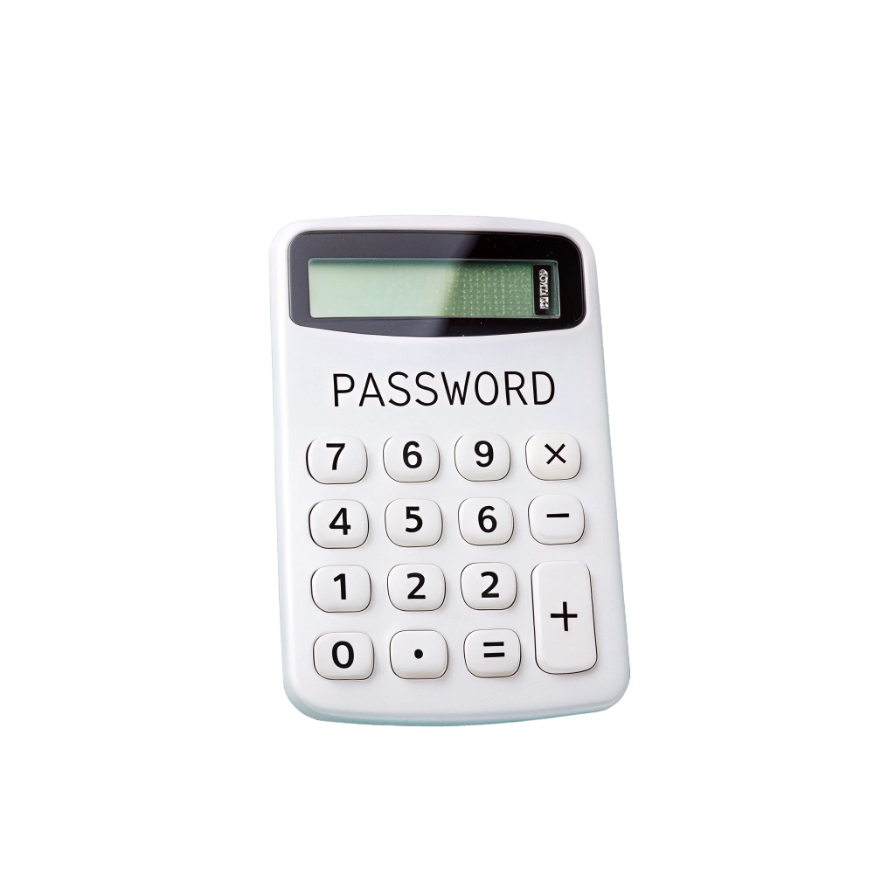

# PasswordCrackCalc



Never start a bruteforce without an idea of the time it will take.


A list of scripts i use to estimate the complexity of password and token bruteforce.

This list of script can be completed, if you have any suggestions or code to share, don't hesitate to contact me.

## 🛠 Requirement

- Python 3
- numpy and pyplot libraries
- matplotlib


## 📊 Usage

Each script can be executed individually. Adjust the parameters at the top of each file to simulate specific conditions relevant to your security context.

Example:
```bash
python password_bruteforce_time.py
python token_bruteforce_optimal_transition.py
python token_bruteforce_simulation.py
```

---

## 📂 Scripts Included

### 0. charSet.py

Simple script to help you quickly find out the number of different characters from a password policy.
It is also used to calculate the number of potential password from this policy.


---

### 1. **password_bruteforce_time.py** 

A password lenght, a bruteforce rate ? This script will tell you how long it will take to crack it.
As this script is cool, it will adapt the scale to the time it will take to crack the password (from second to century).


Calculates the estimated time required to brute-force passwords based on:

- Password complexity policies (character set, length).
- Brute force attempt rate.
- Both probabilistic and deterministic approaches.


---

### 2. **token_bruteforce_optimal_transition.py** 

Determines the optimal moment to transition from token generation to brute-force attempts when tokens must first be generated before testing.

- Uses a probabilistic approach.
- Helps identify when brute-forcing becomes more effective than continued token generation (probably never but usefull if you are on production and afraid to shutdown the service by accident).

Ideal for scenarios where pre-generation of tokens influences brute force strategy.

Requirement : 
1. Reset token can be created without cancelling the previous reset token. 
2. Reset token are valid a limit period of time or not.

Parameters :
- Number of password tested per seconds 
- Number of token created per seconds
- Lifetime of a reset token
- Complexity of the token (set of characters ^ token length)
- Limit number of reset token (optionnal)


---

### 3. **token_bruteforce_simulation.py**

Simulates and visualizes the probability of successfully brute-forcing numeric tokens over time, considering:

- Continuous token generation.
- Continuous brute-force attempts.
- Optional token expiration.
- Maximum simultaneous valid tokens.

Provides a realistic step-by-step analysis of token security under continuous attack scenarios.

Parameters :
- Number of password tested per seconds 
- Number of token created per seconds
- Lifetime of a reset token
- Complexity of the token (set of characters ^ token length)
- Limit number of reset token (optionnal)

---


